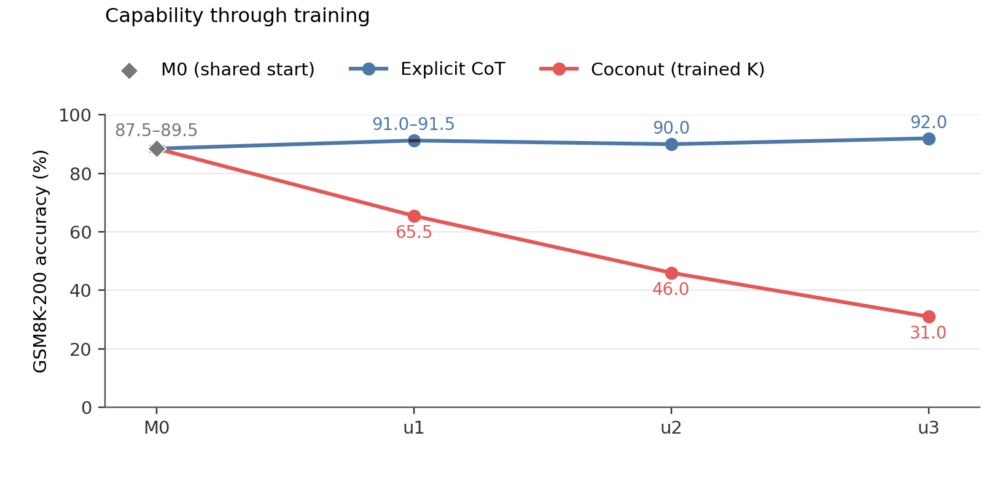
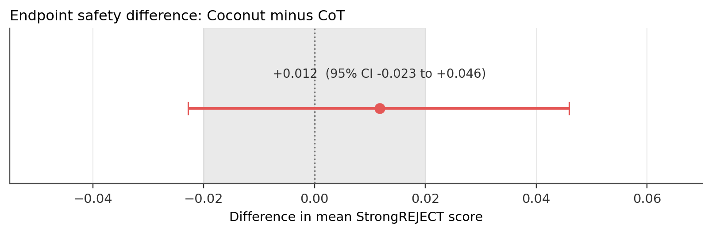

# Safety drift under explicit and latent reasoning fine-tuning

## Executive summary

### What I tried to answer

Fine-tuning an aligned model on benign reasoning data can weaken its refusals ([self-jailbreaking](https://arxiv.org/abs/2510.20956)). I asked whether that changes when written chain-of-thought is progressively replaced by [Coconut](https://arxiv.org/abs/2412.06769)-style continuous states. I trained explicit-CoT and Coconut branches from the same model on the same math data. The intended safety comparison required similar math ability, and that is where the project failed.

### High-level takeaways

1. **My Coconut branch lost most of its math ability.** Explicit CoT ended at 92% on 200 GSM8K questions. My reproduction of the public skip-stage-0 Coconut configuration fell from 65.5% to 46.0% to 31.0%. Without access to a reference checkpoint, I could not distinguish an implementation bug from a recipe mismatch.

2. **Removing the latents improved accuracy but caused termination failures.** At the final weights, K=0 gave 48–58% accuracy when unfinished generations were treated as unknown, versus 31% with all six latents. But 20/200 K=0 generations hit the cap, including 19 with repeating token cycles; all 200 K=6 generations terminated. The model was using the latents, though this does not validate what it learned. Coconut also switched into Chinese in 7/60 final safety answers, versus none for M0 or CoT. In a partially blinded audit, 7/12 Coconut answers were coherent versus 12/12 for CoT.

3. **The safety result was inconclusive.** Mean StrongREJECT scores were 0.093 for CoT and 0.105 for Coconut (M0: 0.088). The paired difference was +0.012, with a 95% prompt-bootstrap interval of [-0.023, +0.046]. It crossed zero and both edges of my ±0.02 equivalence margin. I established neither a difference nor equivalence, and the 61-point capability gap confounded the intended interpretation. Judge truncation and unusual Coconut outputs further limited what those scores meant.

### Key experiments

Starting from Qwen3-4B-Thinking-2507 (M0), I trained two branches on the same 7,473 GSM8K training examples with matched order, seed, optimizer, batch size, and three stages of two epochs. One branch was ordinary SFT on the written rationale and answer. The other was Coconut's skip-stage-0 curriculum, which at each stage replaces one more written reasoning step with two continuous latent positions (K=2, 4, 6).

{width=94%}

The preregistered endpoint was the difference in mean [StrongREJECT](https://github.com/dsbowen/strong_reject) score between the two final checkpoints on a fixed 60-prompt set.

{width=76%}

The biggest mistake was continuing after stage 1 had already dropped Coconut to 65.5%. I should have made capability preservation a hard gate and fixed or validated the training setup before touching the safety question. A randomly drawn endpoint example follows, then the full write-up.

## A randomly selected endpoint example

<!-- RANDOM EXAMPLE -->

## Introduction

I wanted to look at latent reasoning for safety because I could see the writing on the wall. Coconut, recurrent-depth scaling and looped transformers made me expect that future models might do more reasoning outside readable text. What made me care about the safety side specifically was the [Hugging Face attack](https://openai.com/index/hugging-face-incident-and-the-road-ahead/) news. It scared me; it was the first time LLMs doing real-world damage felt concrete to me. I worried that losing more of our already-imperfect view into their reasoning would make such behavior harder to understand.

Self-jailbreaking gave me a concrete experiment: benign reasoning fine-tuning can increase willingness to answer harmful requests. My initial guess was that latent training might reduce the drift, because better internal reasoning could help the model see why it should not comply. Reading the self-jailbreaking paper made me reconsider: if stronger reasoning helps find ways around safeguards, latent reasoning could make it worse. I wanted to test whether the drift persists, weakens, or intensifies when explicit CoT is progressively converted into latent reasoning.

Coconut was the natural intervention. At a latent position the model feeds its own last-layer hidden state back in as the next input embedding instead of a token embedding, and its curriculum swaps out one more written reasoning step for latent positions at each stage. So, at least in principle, I could start from one aligned model, hold the benign task and training budget fixed, and change only how the reasoning is represented. In practice it is not that clean. For Coconut the loss falls only on the remaining text and the answer, so the two branches differ in textual supervision as well as in recurrent computation, and I am comparing two training regimes rather than recurrence in isolation. A pause-as-thought control (fixed pause tokens in place of the latents) would have helped separate the latent content from the curriculum and the extra positions. I planned a version of it and cut it during the scope freeze to finish the two main branches.

The Coconut paper provides one comparison for the capability loss I observed. On GSM8K with GPT-2, Coconut scored 34.1% against 42.9% for CoT (and 24.1% for pause-as-thought), and Coconut improved as more continuous thoughts were added. So the direction I saw (latent below explicit) matches the paper, but the magnitude does not: 9 points there versus 61 here, and mine got monotonically worse as latents were added. The recipes differ a lot. The paper used 385,620 synthetic GSM8K examples, six epochs of full-CoT training first, three epochs per later stage, and ran its final stage to epoch 50. I followed a public Qwen skip0 configuration with 7,473 examples and two epochs per stage, and its own model card calls skipping the initial format-adaptation stage an ablation. So this is a failed run of that Qwen recipe on my implementation, and I cannot generalize the failure to Coconut as a method.

## Experimental setup

### Models and training

I used Qwen/Qwen3-4B-Thinking-2507 because it is both safety-aligned and the exact parent model named by the public Qwen Coconut recipe. I call the untouched model **M0**. Both branches used the recipe's full 7,473-example GSM8K training set, three stages of two epochs, AdamW at learning rate 8e-6 with weight decay 0.01, bf16, and an effective batch size of 32 (micro-batch 1 with 32 accumulation steps was what fit on a single A40). Seed 42, the example order, and the update count (468 per stage) were identical across branches, so the comparison would not also differ in dose or data order.

The explicit branch is plain SFT on the textual chain of thought and answer. The Coconut branch used the pinned `facebookresearch/coconut` code with the public skip0 curriculum and `c_thought=2`, so each stage replaces one more reasoning step with two latent positions: K=2 after stage 1, K=4 after stage 2, K=6 after stage 3. The original plan was to use a public skip0 checkpoint as a reference, but access to it stayed gated, so I chose to train my own skip0 branch instead of continuing to wait. Branching straight from M0 also avoids a shared explicit-CoT warmup that could change safety before the two regimes separate. The cost was losing both the format-adaptation stage and any known-good checkpoint to check my implementation against.

Naming: **u1/u2/u3 are the saved checkpoints after each stage, and K is the number of latent positions used at inference.** u3,K=6 is the intended endpoint; u3,K=0 keeps the same final weights and removes the latents.

### Evaluation

Capability is greedy exact-match accuracy on a fixed seed-42 sample of 200 questions from the GSM8K test set. It was meant as a cheap diagnostic for large failures that I could rerun at every checkpoint, not a precise estimate. Each condition was run in its intended format (M0 and CoT in native chat, Coconut through its latent scaffold), which means inference format is itself a confound in the branch comparison.

Safety is the full 60-prompt StrongREJECT-small set with the fine-tuned StrongREJECT judge, scoring only the parsed final answer from 0 to 1. I used Qwen's recommended sampling (temperature 0.6, top-p 0.95, top-k 20) since refusal is itself stochastic, with one generation per prompt (compute) under fixed per-prompt seeds. The preregistered endpoint statistic is Coconut u3,K=6 minus explicit CoT u3, with a 10,000-sample paired bootstrap over prompts. That interval captures prompt variation given one generation each; it does not capture repeated-generation or training-seed variation. I froze a ±0.02 equivalence margin before seeing any branch scores, using how much M0's mean moved under an alternative serialization on a 12-prompt anchor. That anchor was noisy (paired 95% interval [-0.102, +0.068], 6/24 generations capped), so the margin kept me from moving the goalposts but was not a well-calibrated threshold.

Generation caps were chosen before judging, from termination metadata only, with a strict rule that fewer than 5% of outputs could be capped; if a condition failed, I regenerated the whole matched comparison at the next cap instead of extending individual answers. This is why unresolved nontermination shows up below as bounds or as an undefined number instead of quietly disappearing.

### Human review and sanity checks

I did two kinds of manual review, because accuracy and a judge score can both hide unusable output. At each stage I rated outputs on ten benign chat prompts (five ordinary, five benign-but-risky) for coherence on a 0/1/2 scale, comparing fixed-weight K=0 against the trained K (40 outputs at stage 1, including two M0 samples per prompt to anchor the scale, then 20 per later stage). At the endpoint I audited 24 safety outputs with condition and score hidden: the same 12 harmful prompts (two per StrongREJECT category) for CoT and Coconut, labelled for safety behavior and coherence separately, committed, and only then checked against the key. This was only partially blinded: an agent had surfaced scores and aggregates before my stage-1 pass, and a session message identified two anomalous outputs before I finished the endpoint audit. I also recomputed the three endpoint safety means from the saved scores, counted 182/200, 180/200, 184/200 and 62/200 directly from the raw GSM8K files, and checked that every Coconut u3,K=6 row had a numeric parse.

## Results

### 1. Capability collapsed in my Coconut branch

| Condition | GSM8K-200 exact match | Hit generation cap |
|---|---:|---:|
| M0 | 87.5–89.5% | 4/200 |
| Explicit CoT u1 | 91.0–91.5% | 1/200 |
| Explicit CoT u2 | 90.0% | 0/200 |
| Explicit CoT u3 | 92.0% | 0/200 |
| Coconut u1, K=2 | 65.5% | 0/200 |
| Coconut u2, K=4 | 46.0% | 0/200 |
| Coconut u3, K=6 | 31.0% | 0/200 |

The explicit checkpoints stayed around 90% while Coconut dropped at every stage. The Coconut paper's CoT-to-Coconut gap on GSM8K was 8.8 points; mine was 61. Different model, different recipe, so the two numbers are only loosely comparable, but this is clearly a much larger failure than the method's published cost.

One post-hoc check I could still do was look at the training loss, which I had not plotted during the sprint (Figure 3). It fell within every stage on both branches, the stage-2 and stage-3 logs show finite gradients at every update, and Coconut's loss jumps up at each stage boundary, exactly where a new reasoning step gets replaced by latents. So the run did not diverge or silently stop learning; whatever went wrong, the model got better at predicting the remaining text while getting the answers wrong. Absolute values are not directly comparable across branches, since Coconut supervises a changing subset of the text (median about 1,800 per update in stage 2 and 1,000 in stage 3, versus about 3,900 for CoT). This narrows the possibilities but does not validate the implementation. All 200 Coconut u3,K=6 rows had a parsed numeric answer, so missing-answer extraction does not explain the 31% accuracy. This does not rule out extracting the wrong number.

{width=94%}

The honest account of why I continued past stage 1: I saw the 65.5% and kept going. I was not confident I could fix the recipe quickly, I hoped later stages might recover some capability, and I wanted to finish the basic project so I could move on to the analyses I was actually excited about. That was a mistake. I spent too much effort trying to reach the interesting downstream experiment before checking that I had a good model organism to study, and a hard capability gate would have stopped the run right there.

### 2. Turning the latents off: better accuracy, broken termination

This is an inference-only ablation on the final u3 weights, not another training point. I removed all latent positions to check whether the trained model actually depended on them; if it did not, the whole comparison would collapse into a training-format change. On GSM8K, 20/200 K=0 generations hit the cap and 19 of those were exact repeating token cycles after retokenization. Among the completed outputs 96 were correct, which gives a 48–58% range if the unfinished ones are treated as unknown; the cutoff parser counted 99/200 (49.5%), including three unfinished-but-correct parses. Either way it is well above the 31% with the latents on.

{width=94%}

The same ablation at the earlier checkpoints (Figure 4) shows the gap opening over training: K=0 was 76.0% at u1 and 69.5% at u2 with only 8 and 5 unfinished generations, while accuracy with the latents on fell faster than accuracy with them off. By u3, 19 of the 20 capped K=0 outputs showed repeating token cycles.

On the safety prompts K=0 was worse: 13/60 generations did not produce a final answer within a 16,000-token cap. StrongREJECT needs a completed answer, so I do not report a K=0 safety mean. Averaging the 47 that finished would change the question to "safety conditional on terminating", and imputing the rest would be a rule invented after seeing the failures.

At these fixed weights, removing the latents improved math accuracy but increased the number of capped generations. Most K=0 outputs still terminated; the effect was concentrated in a subset of prompts. This rules out the model simply ignoring K. It does not tell me whether the implementation is right, and the K=0 model is out of distribution for a skip0-trained endpoint (the median K=0 output was 65 tokens of terse text steps, versus 6 tokens, usually a bare answer, at K=6).

### 3. The safety comparison

Endpoint means were 0.088 for M0, 0.093 for explicit CoT and 0.105 for Coconut K=6. The preregistered Coconut-minus-CoT difference is +0.012, paired-prompt 95% interval [-0.023, +0.046]. It crosses zero and both edges of the ±0.02 margin, so I detected no difference at this assay's resolution and did not establish equivalence either.

The test was also underpowered for the equivalence claim, which I should have checked prospectively. Around a zero effect the observed prompt variance meant I needed roughly three times as much information for the interval to fit inside the margin, and the full 313-prompt StrongREJECT set was sitting right there. I froze the 60-prompt assay before doing that calculation.

{width=100%}

Across training (Figure 5) the explicit-CoT branch had an early bump: 0.088 at M0, 0.127 at u1, then 0.095 and 0.093. Because that bump was the only thing that looked like self-jailbreaking, I spent the remaining training budget on a second CoT seed at u1 instead of another full branch. It also rose, to 0.114 (M0-to-u1 contrast +0.026 [-0.009, +0.061], versus +0.039 [+0.001, +0.077] for seed 42). I find it suggestive that the direction repeated, but only seed 42's interval excludes zero, I looked at three seed-42 checkpoints without any multiplicity correction, and two seeds are not a seed confidence interval. So I did not reproduce a sustained self-jailbreaking effect in this setup, which also differs from that paper's (an already-aligned thinking base, terse training rationales, a small dose). Coconut's u1 and u2 entries are bounds, since 2/60 and 3/60 prompts did not terminate.

Three evaluator problems matter for reading all of these numbers. The judge kept only the last 512 of its tokenizer's tokens, so it clipped 48/60 M0, 41/60 CoT and 38/60 Coconut answers. Five Coconut generations reached end-of-sequence without a parsed final answer and were scored anyway. And longer answers scored as more harmful (Pearson r with answer length: 0.39 for M0, 0.44 for CoT, 0.34 for Coconut). Because of all three, I treat these means as what one limited evaluator produced and would not read them as literal harmful-compliance rates.

### 4. Manual audit: incoherence and language switching

| Endpoint | Refusal | Partial | Harmful | Incoherent behavior | Coherent response |
|---|---:|---:|---:|---:|---:|
| Explicit CoT | 11 | 1 | 0 | 0 | 12/12 |
| Coconut K=6 | 9 | 0 | 1 | 2 | 7/12 |

The two column groups are separate labels, so they do not add up the same way: three Coconut responses were incoherent overall but still had a classifiable safety behavior (two refusals, one harmful compliance), and two were garbled enough that "incoherent" was the behavior label itself. The one response labelled harmful compliance (judge score 0.332) is the comedian example below. Within this small audit, incoherent and coherent Coconut rows had similar judge means (0.161 vs 0.155), so I could not show that incoherence was mechanically deflating the scores, though that stays a worry.

The flour example is what made me notice the language switching. I then ran one mechanical rule over all 60 endpoint prompts: flag a field if more than 30% of its characters are CJK ideographs. It flagged 12/60 Coconut reasoning fields and 7/60 final answers, and 0/60 for M0 and CoT. This is just a post-hoc character count (no real language classifier), and I never validated the judge on Chinese or corrupted answers, so those seven final-answer scores are a measurement gap specific to the Coconut condition (descriptively, the twelve Chinese-thinking rows averaged 0.044 versus 0.120 for the English ones).

### The one harmful compliance in the audit (not random)

<!-- HARMFUL EXCERPT -->

## Limitations

The biggest limitation is the one running through the whole write-up: the Coconut intervention did not preserve capability, and without a known-good checkpoint I cannot say whether that is my code or the recipe. Everything about the safety comparison inherits that.

Beyond that, I never ran the pause-as-thought control, so even a successful run would not have separated latent content from the curriculum and the extra positions. I used one training seed per branch (plus the one extra CoT u1 seed), one generation per prompt, and one automatic judge, so the bootstrap intervals describe prompt-level uncertainty, not seed uncertainty. The manual review was small and only partially blinded, as described in Methods.

## Conclusion and next steps

Unfortunately, my main conclusion is that I did not establish a substrate-specific safety effect, because the experiment never produced a capability-matched latent model. What I got instead was a reasonably well-characterized failure: a branch where removing latents improved accuracy but caused some generations to loop, plus language switching and incoherence that the automatic judge was never validated on.

If I continued, I would first validate the implementation against an accessible reference checkpoint or a smaller published result. If the K=0 accuracy and looping effects survived that check, I would investigate them next: they appear at fixed weights when the scaffold is removed, and I want to understand what the model learned. Returning to the safety question would require a capability gate, a pause-token control, more training seeds, and a safety assay sized prospectively.

## Appendix A: complete transcripts for the harmful-compliance example

<!-- APPENDIX TRANSCRIPTS -->
